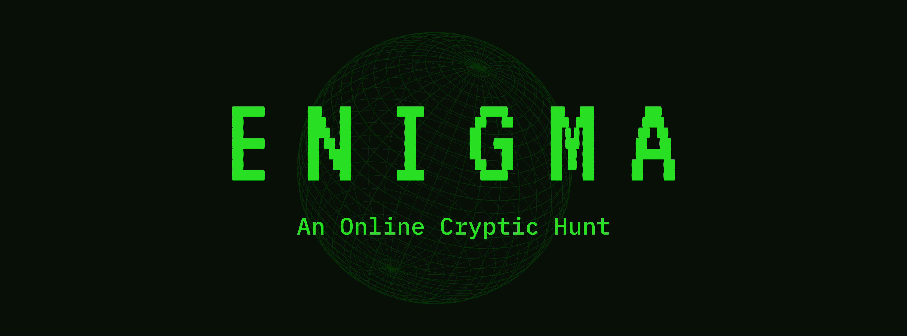
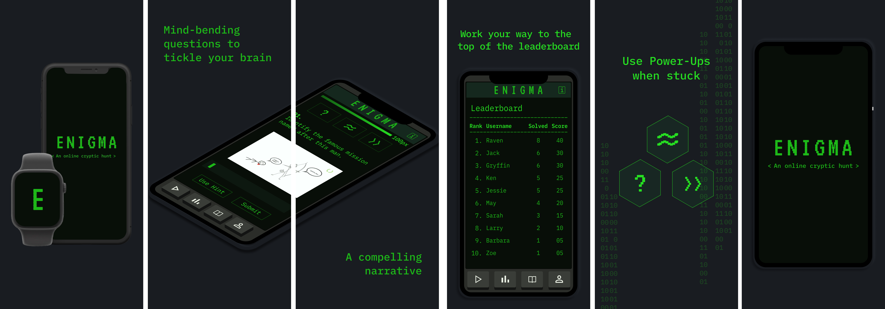

 

## About

Enigma 7.0 is an online cryptic hunt organized by the IEEE-VIT Student Chapter. This initiative is completely developed and led by students, and is played by thousands of competitors from all over the world. This being the 7th edition of Enigma, we remain undefeated as no one has ever been able to complete our challenge!

A cryptic hunt with a compelling storyline that you have to navigate skillfully also features two kinds of currency in the game XP with powerups that can be used through each level of the game. The participant with the highest number of points on the leaderboard wins the coveted title.

We aim to create a platform where people from all over the world come together and battle for points using their problem-solving skills and out-of-the-box methodologies to crack the code. Only the best will grace the topmost spots on the leaderboard!

You can download the app [here](https://apps.apple.com/in/app/enigma-7-0/id1534408287)

## Photos

<a href="https://apps.apple.com/in/app/enigma-7-0/id1534408287"> 
 </a>

 

## Getting Started

To get started:

-   Clone the repo.
    `git clone https://github.com/IEEE-VIT/enigma7-iOS.git`
-   Checkout to a new branch.
    `git checkout -b my-amazing-feature`
-   Make some amazing changes.
-   `git add .`
-   `git commit -m "A short description about the feature."`
-   `git push origin my-amazing-feature`
-   Open a pull request 

To start contributing, check out [`CONTRIBUTING.md`](https://github.com/IEEE-VIT/enigma7-iOS/blob/update/CONTRIBUTING.md) . New contributors are always welcome to support this project.

## Contributors ✨

Thanks goes to these wonderful people ([emoji key](https://allcontributors.org/docs/en/emoji-key)):

<table>
	<tr>
		<td align="center">
			<a href="https://github.com/aaryankotharii"> <b>Aaryan K</b></a>  <a href="https://github.com/IEEE-VIT/enigma7-iOS/commits?author=aaryankotharii" title="Code"> 💻 </a>
		</td>
	</tr>
</table>

 
<h2 align = "center"> <b> Made with ❤️ by IEEE-VIT </b> </h2>

