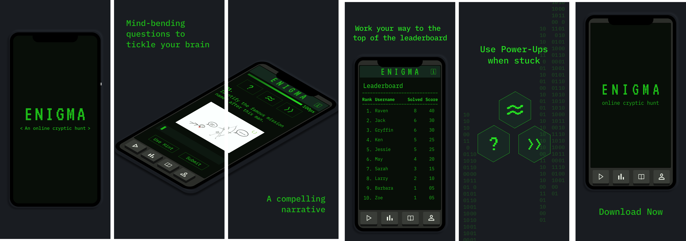
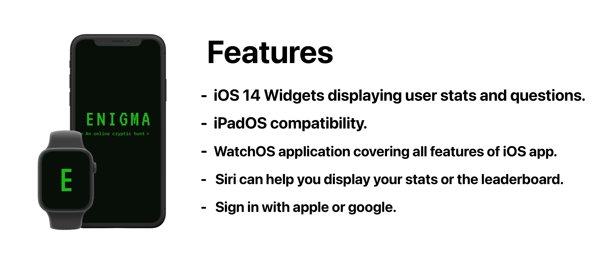

   

  <b>
Enigma 7.0 is an online cryptic hunt organized by the IEEE-VIT Student Chapter. This initiative is completetly developed and led by students, and is played by thousands of competitors from all over the world. This being the 7th edition of Enigma, we remain undeafeated as no one has ever been able to complete our challenge!
  
We aim to create a platform where people from all over the world come together and battle for points using their problem-solving skills and out-of-the-box methodologies to crack the code. Only the best will grace the topmost spots on the leaderboard!
  </b>

   

   

 

 <b> Made with ❤️ by IEEE-VIT </b> 

